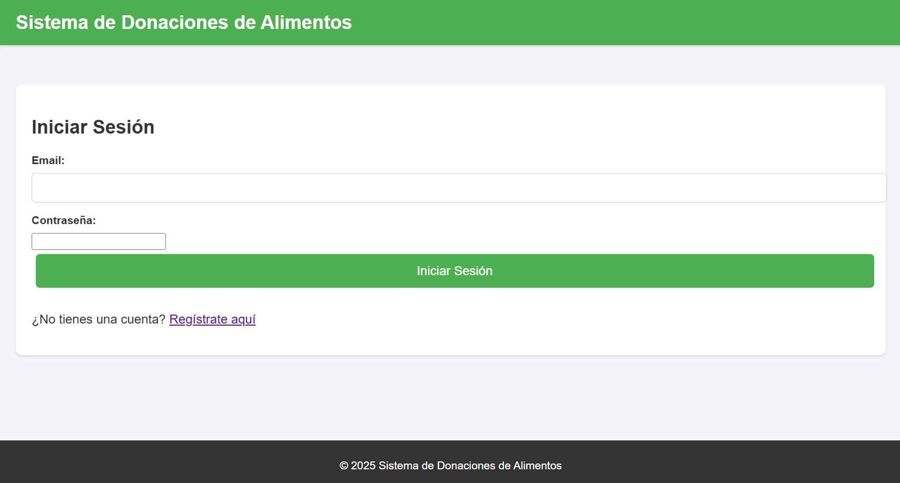
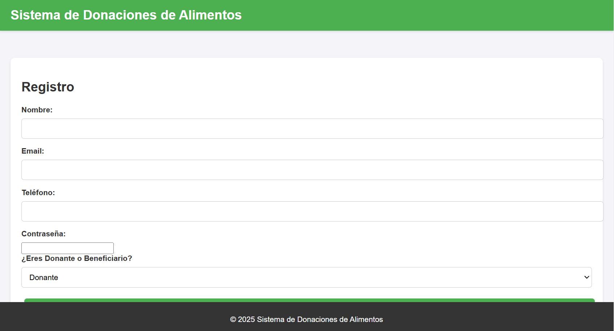
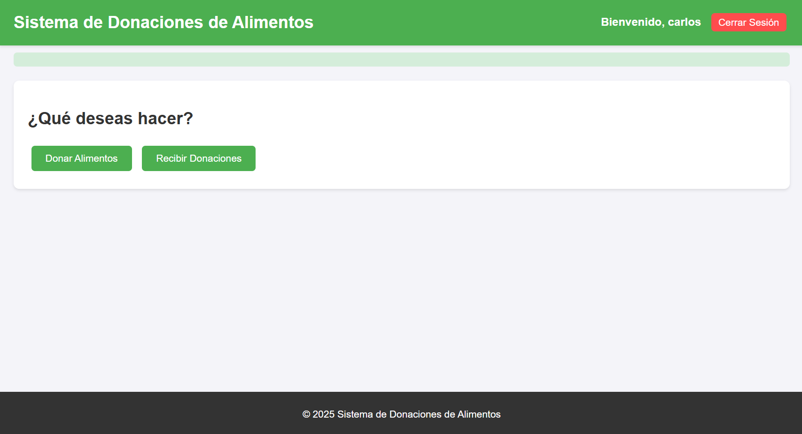
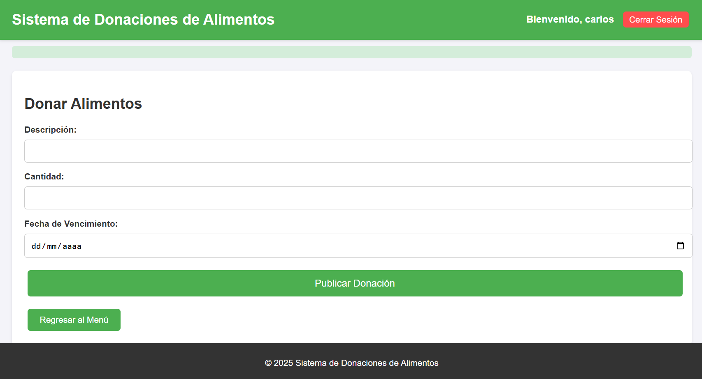
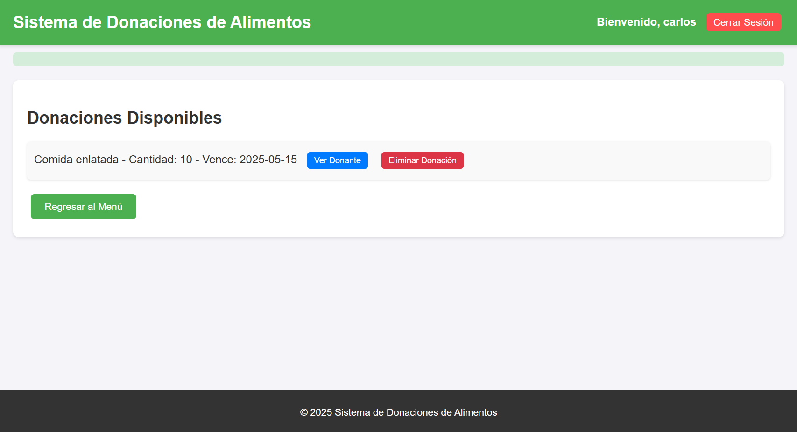
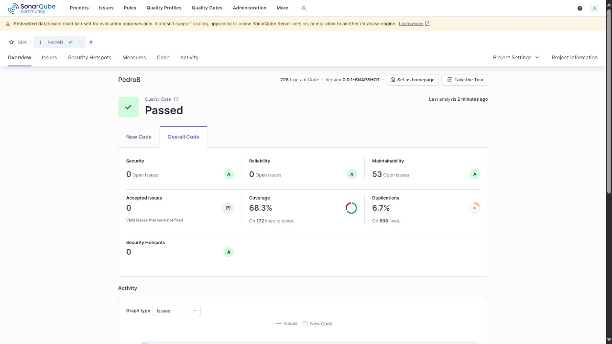
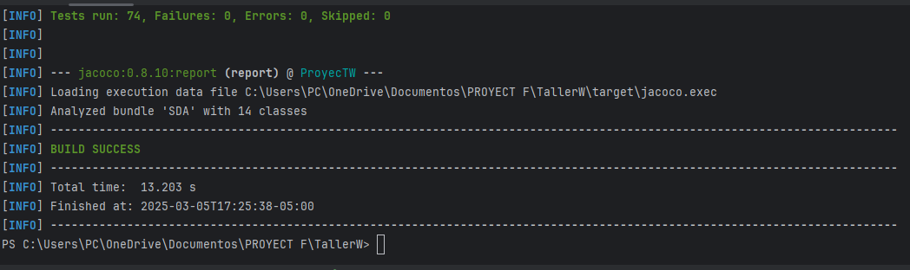
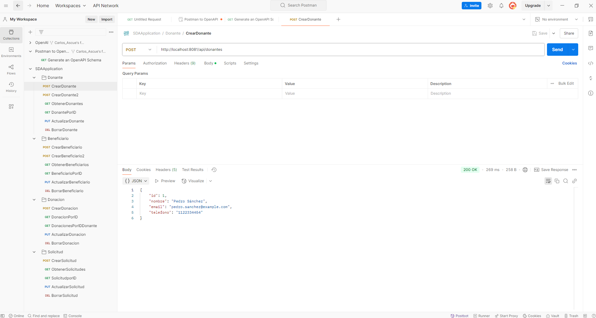

# Índice

1. [Web Donaciones](#web-donaciones)
2. [Equipo de Trabajo](#equipo-de-trabajo)
3. [README - Web Donaciones](#readme---web-donaciones)
   - [Propósito del Software](#propósito-del-software)
   - [Alcance](#alcance)
   - [Principales Funciones](#principales-funciones)
4. [Integración con Jenkins Pipeline](#integración-con-jenkins-pipeline)
   - [Construcción Automática](#construcción-automática)
   - [Análisis Estático](#análisis-estático)
   - [Pruebas Unitarias](#pruebas-unitarias)
   - [Pruebas Funcionales](#pruebas-funcionales)
   - [Pruebas de Rendimiento](#pruebas-de-rendimiento)
  5. [Gestión de GitHub Issues](#gestión-de-github-issues)

# Web Donaciones
- **Fecha**: [05/03/2025]

## Equipo de Trabajo
- [Carlos Ascue Orosco](https://github.com/CarlosAscueOrosco)
- [Pedro Emanuel Barazorda Medrano](https://github.com/Theratoffqa)

# README - Web Donaciones

## Propósito del Software
El objetivo de **Web Donaciones** es conectar de manera efectiva y sencilla a donantes de comida con beneficiarios que tienen la necesidad de estos. La plataforma busca facilitar la donación de alimentos, reducir el desperdicio y asegurar que las personas necesitadas reciban ayuda de manera rápida y eficiente.

## Alcance
El alcance del proyecto incluye:
- Desarrollo de una plataforma web que permita a los donantes registrar y ofrecer alimentos.
- Creación de un sistema para que los beneficiarios puedan solicitar y recibir donaciones.
- Implementación de un medio de comuniación para conectar donantes y beneficiarios cercanos.

## Principales funciones 
1. Iniciar Sesión
Permite a los usuarios (donantes y beneficiarios) acceder a la plataforma con sus credenciales.



### 2. Registrarse
Los nuevos usuarios pueden crear una cuenta para comenzar a usar la plataforma.



### 3. Menú de Opciones
Una vez autenticados, los usuarios pueden navegar por las diferentes opciones de la plataforma.



### 4. Donar
Los donantes pueden registrar y ofrecer alimentos para donación.



### 5. Donaciones Disponibles
Los beneficiarios pueden ver las donaciones disponibles y solicitarlas.


## Integración con Jenkins Pipeline
### Construcción Automática
**Herramienta/Framework:** Maven 3.9.9
#### Comandos:
```bash
mvn compile
mvn package 
```
#### Integración con Jenkins:
```
stage('Build') {
    steps {
        bat 'mvn compile'
    }
}
stage('Empaquetado') {
    steps {
        bat 'mvn package -DskipTests'
    }
}
```
### Análisis estático
**Herramienta/Framework:** SonarQube - Sonar Scanner
#### Evidencia:

### Integración con Jenkins:
```
stage('Análisis Estático de Código Fuente') {
    steps {
        bat 'mvn sonar:sonar -Dsonar.token=Token,SonarQube'
    }
}
```
### Pruebas Unitarias
**Herramienta/Framework:** JUnit (integrado en Maven)
#### Evidencia:

### Integración con Jenkins:
```
stage('Pruebas Unitarias') {
    steps {
        bat 'mvn test'
    }
}
```
### Pruebas de APIs

**Herramienta/Framework:** Newman (Postman)
#### Evidencia:

### Integración con Jenkins:s
```
stage('Pruebas de APIs') {
    steps {
        bat '"C:\\Users\\ikuto\\AppData\\Roaming\\npm\\newman.cmd" run src/test/java/com/tallerweb/sda/controller/SDAApplication.postman_collection.json'
    }
}
```